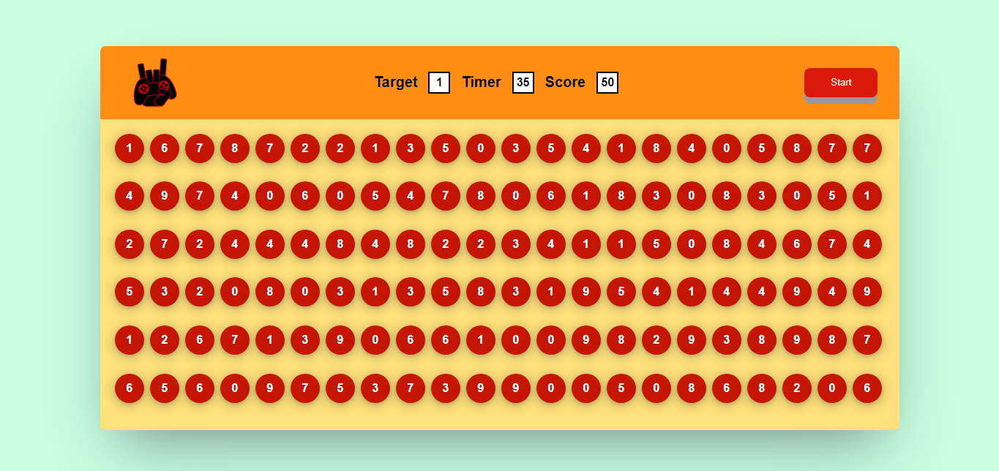
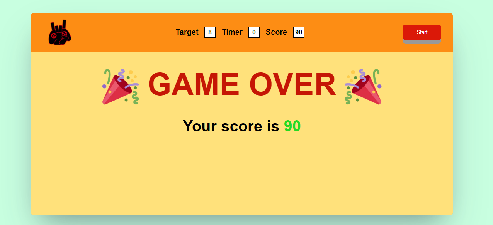

# Bubble Game Project
This project is a simple bubble game that tests your ability to view things quickly.

## Built with
- HTML5
- CSS3
- Javascript

I have started learning frontend development and I think you learn more by doing the practical work.
This project is purely created by only using HTML, CSS, and Javascript.
I have added the screenshots of the game. You can check the game by cloning this repository.

## Made By
[NISHANT VILKAR](https://github.com/almightynv)
- [Linkedin](https://www.linkedin.com/in/nishantvilkar076/)
